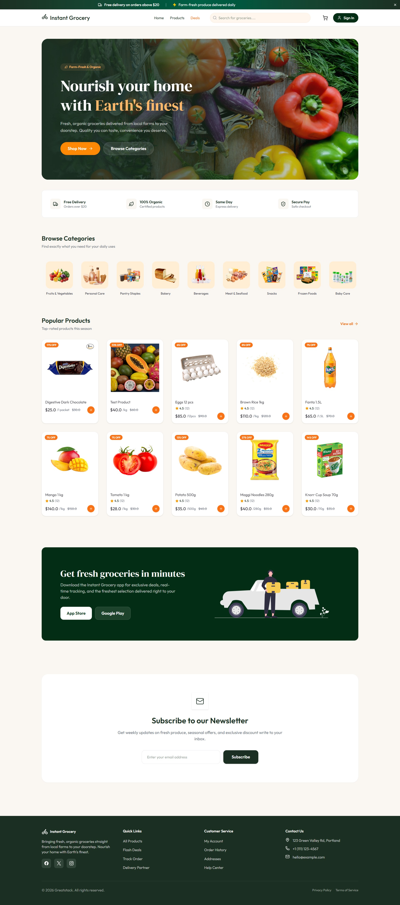

# Instant Grocery Delivery

A full-stack grocery delivery platform built with React, TypeScript, Node.js, Express.js, PostgreSQL, Prisma, and Inngest.

## Project Preview

## Features

- Role-based authentication
- Admin, User, and Delivery Partner dashboards
- Product and order management
- Real-time order tracking
- Live location sharing
- Delivery partner auto-assignment
- Automated email notifications
- Background jobs with Inngest

## Tech Stack

- React.js
- TypeScript
- Tailwind CSS
- Node.js
- Express.js
- PostgreSQL
- Prisma
- Inngest

## Live Demo

https://instant-grocery-delivery.vercel.app/
